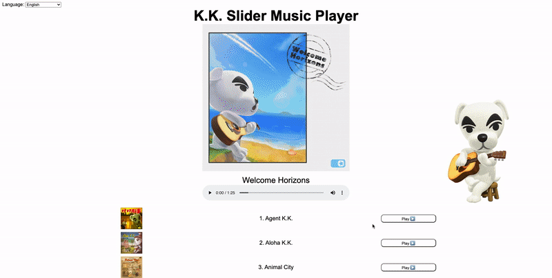

# K.K. Slider Music Player

## Description

This is a single page web-application that utilizes the /songs endpoint of an Animal Crossing New Horizons API to create a music player for all K.K. Slider songs in the game. 

In the top left you will find a drop down menu to select your language. The two main parts of this program are the music player and the tracklist. 
Select the track you would like to hear by pressing the play button on that track and enjoy!

## Installation

Clone this repository and save to your local environment

## Executing Program

Open index.html by either:

- opening the file from your file explorer
- pasting the file's path into your browser's address bar
- navigating to the directory where it is saved in your terminal and using 
```
open index.html
```
## Functionality

Language selection functionality: 


Track selection functionality: 




## Acknowledgments 

- [Animal Crossing New Horizons API](https://acnhapi.com/doc) created by Alexis#8717 (Discord)
- Eric Gaspar for inspiration and encouragement